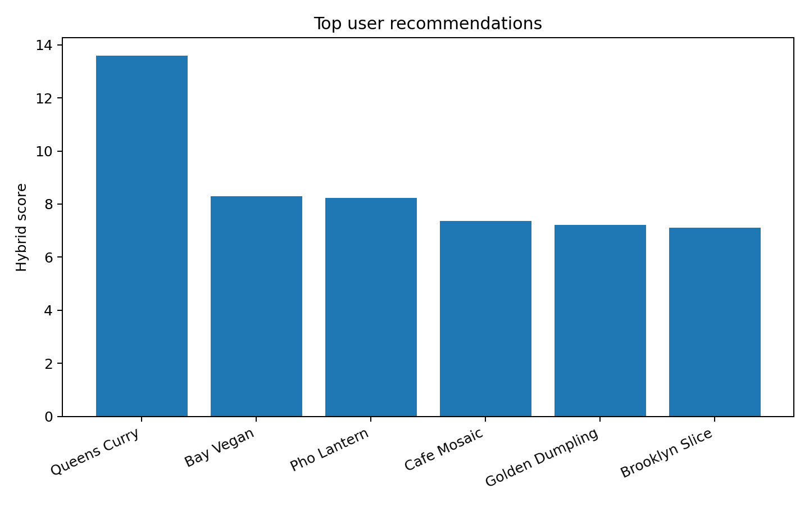
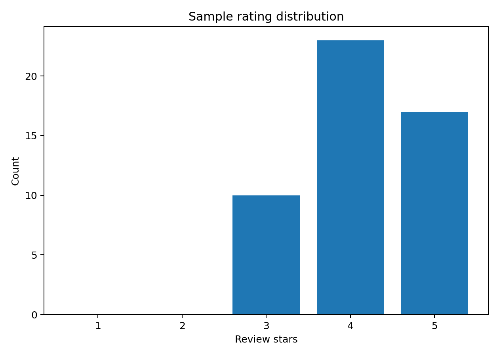
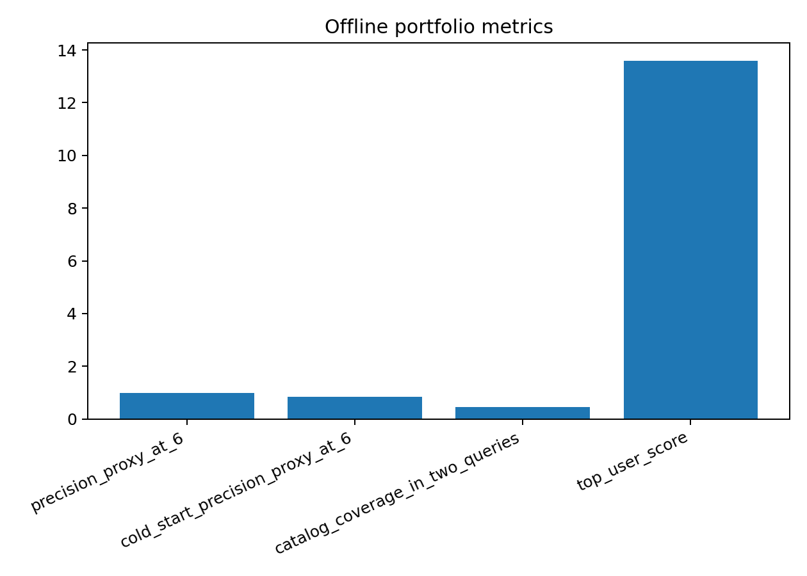

# Restaurant Hybrid Recommender

Restaurant Hybrid Recommender is a portable recommendation system that combines content similarity, collaborative signals, popularity fallback, and location-aware ranking. It includes a cold-start path, exported recommendation files, evaluation metrics, and figures.

## Core Capabilities

- Content-based similarity over restaurant metadata and text features.
- Collaborative scoring from user-item review interactions.
- Popularity fallback for sparse user histories.
- Location-aware reranking with a distance penalty.
- Cold-start recommendations for new users.
- Exported personalized and cold-start recommendation artifacts.
- Offline metrics, score tables, plots, and experiment report.

## Dataset

The repository includes a compact sample restaurant dataset designed for fast local execution and transparent inspection.

| Entity | Count |
|---|---:|
| Restaurants | 18 |
| Users | 10 |
| Reviews | 50 |

The sample covers cuisines, ratings, locations, review histories, and metadata fields used by the hybrid ranking pipeline. It is small enough to run quickly while still exercising personalization, cold-start behavior, popularity fallback, and location-aware ranking.

## Generated Results

| Metric | Result |
|---|---:|
| precision_proxy@6 | 1.0000 |
| cold_start_precision_proxy@6 | 0.8333 |
| catalog_coverage_in_two_queries | 0.4444 |
| top_user_score | 13.5855 |

Top recommendation scores:



Rating distribution:



Offline metrics:



Generated artifacts:

- `outputs/metrics/recommender_metrics.json`
- `outputs/recommendations/user_u1_recommendations.json`
- `outputs/recommendations/cold_start_recommendations.json`
- `outputs/tables/recommendation_score_table.csv`
- `outputs/figures/top_scores.png`
- `outputs/figures/rating_distribution.png`
- `outputs/figures/offline_metrics.png`
- `outputs/reports/EXPERIMENT_REPORT.md`
- `outputs/logs/run.log`

## Quickstart

```bash
python -m venv .venv
pip install -e .
PYTHONPATH=src pytest -q
bash scripts/generate_outputs.sh
```

## Repository Layout

```text
docs/                       Dataset and implementation notes
notebooks/                  Prototype and demonstration notebooks
outputs/                    Generated metrics, recommendations, figures, and logs
scripts/                    Output-generation scripts
src/restaurant_recsys/      Ranking, data, graph, content, collaborative, and CLI code
tests/                      Unit tests
```
